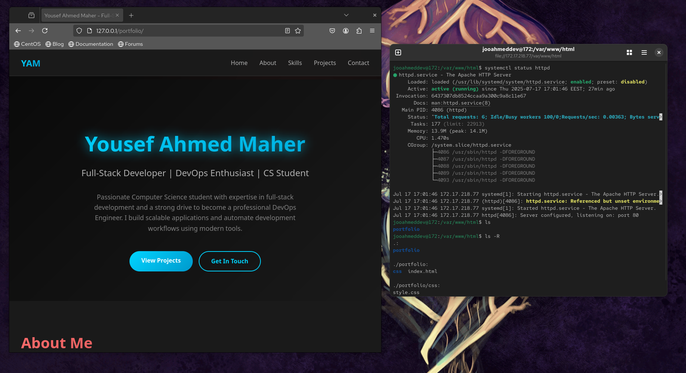

# Apache Portfolio Site



> A simple static portfolio website hosted on a CentOS/RHEL Apache web server.

---

## 📁 Project Structure

```
portfolio/
├── index.html
└── css/
    └── style.css
```

---

## 🛠️ Built With

- **HTML5** – Structure
- **CSS3** – Styling
- **Apache (httpd)** – Web server
- **CentOS / RHEL 9** – Hosting OS
- **Git** – Version control

---

## 🚀 Deploy on CentOS / RHEL 9

### 🔧 Prerequisites

- CentOS or RHEL 9 machine
- Apache installed
- Git installed

### ⚙️ Steps

1. **Install Apache**:
   ```bash
   sudo dnf install -y httpd
   sudo systemctl enable --now httpd
   ```

2. **Clone the repository**:
   ```bash
   git clone https://github.com/Yousefa7medmaher/Linux-.git
   ```

3. **Copy project files to Apache web root**:
   ```bash
   cd Linux-/apache-portfolio-site
   sudo cp -r portfolio/* /var/www/html/
   ```

4. **(Optional) Open firewall**:
   ```bash
   sudo firewall-cmd --add-service=http --permanent
   sudo firewall-cmd --reload
   ```

5. **Access the site in your browser**:
   ```
   http://<your-server-ip>
   ```
